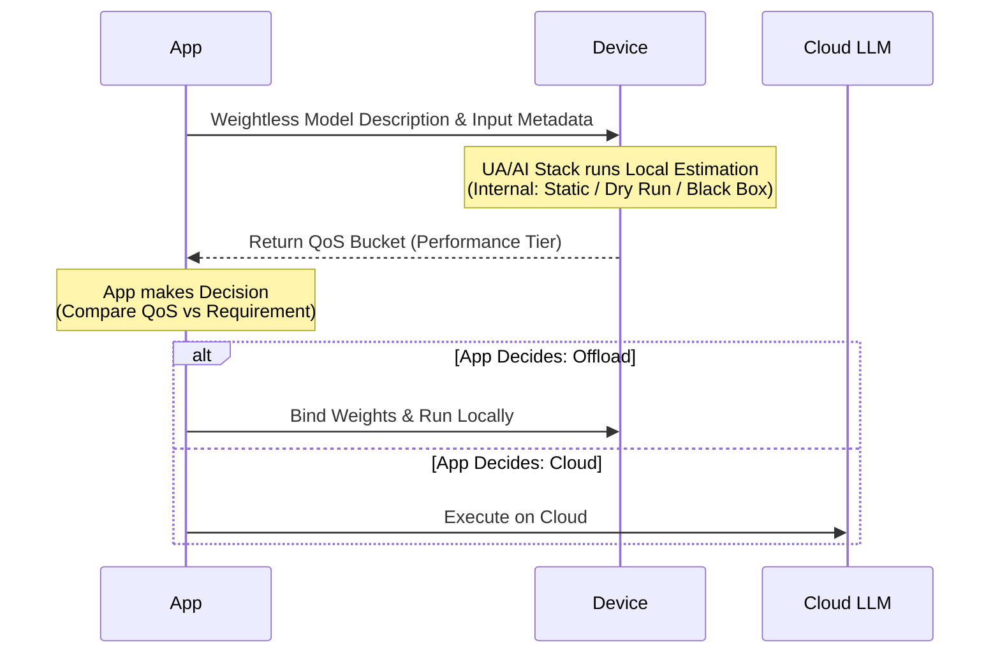
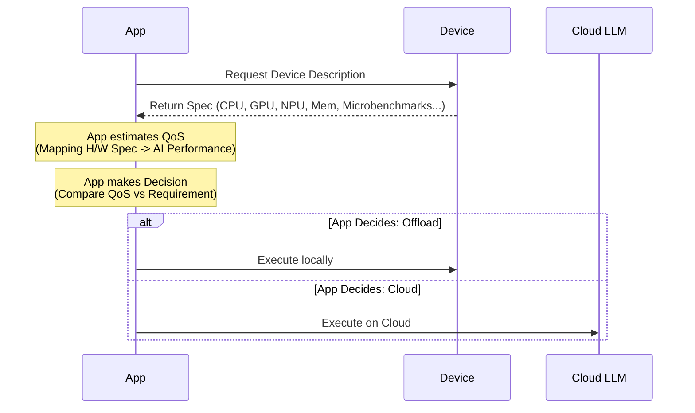

# Dynamic AI Offloading Protocol (DAOP) — Explainer

> 📺 **[Live Demo](daop-illustration/)** — Browser-based illustration of `estimateQoS()` with interactive micro-benchmarks

## Table of Contents
- [Authors](#authors)
- [Participate](#participate)
- [Introduction](#introduction)
- [User-Facing Problem](#user-facing-problem)
  - [Goals](#goals)
  - [Non-goals](#non-goals)
- [User research](#user-research)
- [Use Cases](#use-cases)
  - [Adaptive Video Conferencing Background Blur](#adaptive-video-conferencing-background-blur)
  - [Privacy-Preserving Photo Enhancement](#privacy-preserving-photo-enhancement)
- [Proposed Approach: Model-Centric Evaluation (Callee Responsible)](#proposed-approach-model-centric-evaluation-callee-responsible)
  - [Standardized Specification Requirements](#standardized-specification-requirements)
  - [The `estimateQoS()` API](#the-estimateqos-api)
  - [The "Weightless" Requirement and WebNN Spec Extensions](#the-weightless-requirement-and-webnn-spec-extensions)
  - [Performance Tiers](#performance-tiers)
- [Implementation Considerations (AI Stack Internals)](#implementation-considerations-ai-stack-internals)
  - [Example Code: Adaptive Background Blur](#example-code-adaptive-background-blur)
- [Discussion: Potential API Enhancements](#discussion-potential-api-enhancements)
  - [1. Boolean Requirement API](#1-boolean-requirement-api)
  - [2. QoS Change Events](#2-qos-change-events)
- [Alternatives considered](#alternatives-considered)
  - [Device-Centric Approach (Caller Responsible)](#device-centric-approach-caller-responsible)
- [Accessibility, Internationalization, Privacy, and Security Considerations](#accessibility-internationalization-privacy-and-security-considerations)
  - [Privacy](#privacy)
  - [Security](#security)
- [Stakeholder Feedback / Opposition](#stakeholder-feedback--opposition)
- [References & acknowledgements](#references--acknowledgements)

## Authors

- Jonathan Ding (Intel)

## Participate

- [Issue tracker - Dynamic AI Offloading Protocol (DAOP)](https://github.com/webmachinelearning/proposals/issues/15)

## Introduction

This proposal addresses the challenge of efficiently offloading AI inference tasks from cloud
servers to client devices while maintaining Quality of Service (QoS). This protocol provides a more
effective mechanism for applications to evaluate whether a specific AI inference request is suitable
for execution on the client side. It moves beyond static hardware specifications by enabling
dynamic, privacy-preserving assessment of device capabilities, helping applications make informed
offloading decisions. Throughout this document, the **Application (App)** represents the
decision-making logic, which may reside on the client device (e.g., in a web browser) or on a cloud
server.

## User-Facing Problem

Modern web applications increasingly rely on AI, but running these models solely in the cloud can be
expensive and introduce latency. Conversely, running them on client devices is difficult because
developers cannot easily determine if a target device—given its specific CPU, GPU, and NPU
capabilities—can host a specific AI model without compromising performance or user privacy.

### Goals

- Standardize a mechanism for identifying device performance buckets for AI tasks.
- Enable efficient offloading of AI inference from cloud to client devices.
- Maintain high Quality of Service (QoS) during offloading.
- Protect user privacy by avoiding detailed hardware fingerprinting.
- Provide a future-proof abstraction that works across varying hardware (CPU, GPU, NPU).
- Define a protocol that works regardless of whether the decision logic resides in the App's cloud
  backend or client frontend.

### Non-goals

- Defining the specific wire protocol for model transmission (this focuses on the
  negotiation/estimation).
- Mandatory implementation of any specific inference engine.
- Solving all AI workload types in version 1 (e.g., extremely large LLMs with dynamic shapes).

## User research

[Placeholder for user research findings. Initial feedback from ISVs and web developers indicates a
strong need for predictable client-side AI performance metrics.]

## Use Cases

### Adaptive Video Conferencing Background Blur

A video conferencing application wants to offload background blur processing to the user's laptop to
save server costs and improve privacy, but only if the device can maintain a stable 30fps.

1. **Inquiry**: The application builds a weightless graph of its blur model and calls
   `context.estimateQoS()`.
2. **Estimation**: The device evaluates its capability by integrating a wide range of local
   intelligence: the AI stack software (including specialized drivers and runtimes), the specific
   hardware accelerators, current system state (thermal state, battery level, power mode), and
   environmental configurations that might affect performance.
3. **Decision**:
   - If the `performanceTier` meets the application's requirements (e.g., "excellent", "good", or
     "fair" for real-time video), the application logic decides to download the full weights, bind
     them, and run locally.
   - Otherwise (e.g., "slow", "very-slow", "poor"), it falls back to cloud-based processing.

### Privacy-Preserving Photo Enhancement

A photo editing web app wants to run complex enhancement filters using the user's mobile NPU to
reduce latency and maintain privacy.

1. **Inquiry**: The application provides a weightless description of the enhancement model to
   `context.estimateQoS()`, including specific target resolutions.
2. **Estimation**: The device evaluates its capability by considering the current hardware and
   software environment, including AI stack optimizations, hardware accelerators (such as NPU), and
   overall system state (e.g., battery level, power mode, thermal conditions).
3. **Decision**: The application enables the "High Quality" filter locally if the performance tier
   meets the requirements.

## Proposed Approach: Model-Centric Evaluation (Callee Responsible)

The preferred approach is **Model-Centric**, where the device (the callee, i.e., the responder to
the AI request) is responsible for evaluating its own ability to handle the requested AI workload.
In this model, the **Application** (the caller) sends a **Model Description Inquiry**—a weightless
description of the AI model and input characteristics—to the device. The device, as the callee, uses
its local knowledge of hardware, current system state, software environment, and implementation
details to estimate the expected Quality of Service (QoS) for the given task.



This "callee responsible" design ensures that sensitive device details remain private, as only broad
performance tiers are reported back to the application. It also allows the device to make the most
accurate estimation possible, considering real-time factors like thermal state, background load, and
hardware-specific optimizations that are not visible to the caller (whether the caller logic is in
the cloud or on the client). By shifting responsibility for QoS evaluation to the callee, the
protocol achieves both privacy protection and more reliable offloading decisions.

### Standardized Specification Requirements

To enable consistent cross-vendor estimation, the protocol requires standardization of the following
inputs and outputs:

1. **Weightless Model Description**:
   - Based on the **WebNN Graph topology**.
   - Includes **Lazy Bind Constants**: Placeholders for weights (via descriptors and labels) that
     enable "weightless" graph construction and estimation without downloading large parameter
     files.
  - **Dynamic vs. Static Graph Expression**: This proposal currently uses the dynamic WebNN
    `MLGraphBuilder` API to construct the weightless graph at runtime. An alternative approach is
    to express the graph topology statically using a declarative format. The
    [webnn-graph][ref-webnn-graph] project defines a WebNN-oriented graph DSL (`.webnn` format)
    that separates the graph definition (structure only, no tensor data) from a weights manifest
    and binary weights file. This static representation is human-readable,
     diffable, and enables tooling such as ONNX-to-WebNN conversion and graph visualization. A
     future version of DAOP could accept either a dynamically built `MLGraph` or a statically
     defined `.webnn` graph description as input to `estimateQoS()`.
2. **Model Metadata (Optional)**:
   - Information about the weights that can significantly impact performance, such as **sparsity**
     or specific quantization schemes.
3. **Input Characterization**:
   - The **shape** and **size** of the input data (e.g., image resolution, sequence length).
4. **QoS Output**:
   - Unified **Performance Tiers** (e.g., "excellent", "good", "fair", "moderate", "slow",
     "very-slow", "poor") to ensure hardware abstraction and prevent privacy-leaking through precise
     latency metrics.

### The `estimateQoS()` API

We proposes a core API for performance negotiation:

```webidl
dictionary MLQoSReport {
  MLPerformanceTier performanceTier;
};

partial interface MLContext {
  Promise<MLQoSReport> estimateQoS(MLGraph graph, optional MLQoSOptions options);
};

dictionary MLQoSOptions {
  // Input characteristics
  record<DOMString, MLOperandDescriptor> inputDescriptors;

  // Weights characteristics (Optional)
  boolean weightsSparsity = false;
};
```

### The "Weightless" Requirement and WebNN Spec Extensions

To maximize the benefits of DAOP, the underlying WebNN specification should support a **weightless
build mode**. Currently, WebNN's `constant()` API typically requires an `ArrayBufferView`, which
implies the weights must already be present in memory.

We propose that WebNN builders be extended to allow:

1. **Weightless Constants**: Defining constants using only their descriptor (shape, type) and a
   `label` for late-binding.
2. **Lazy / Explicit Binding**: Separating the graph topology definition from the binding of heavy
   weight data. By using an explicit `bindConstants()` (or similar) method, we achieve **lazy
   binding** where weights are only provided and processed after the offloading decision is made.
  This design aligns with the proposal in
  [webnn#901][ref-webnn-901], which addresses the same
   fundamental problem from a memory-efficiency perspective. That proposal allows
   `builder.constant()` to accept just an `MLOperandDescriptor` (shape and type, no
   `ArrayBufferView`), producing a "hollow constant" handle. After `builder.build()`, weights are
   streamed to device memory one at a time via `graph.setConstantData(constantOperand, dataBuffer)`,
   reducing peak CPU memory from ~3× model size to ~1×. Our `bindConstants()` API could be
   integrated with or replaced by this `setConstantData()` mechanism in a future version of the
   spec, combining the benefits of weightless QoS estimation with memory-efficient weight loading.

### Performance Tiers

The `estimateQoS()` API returns a `performanceTier` string that represents the device's estimated
ability to execute the given graph. The tiers are designed to be broad enough to prevent hardware
fingerprinting while still enabling meaningful offloading decisions:

| Tier          | Indicative Latency | Interpretation                         |
| ------------- | ------------------ | -------------------------------------- |
| `"excellent"` | < 16 ms            | Real-time (60 fps frame budget)        |
| `"good"`      | < 100 ms           | Interactive responsiveness             |
| `"fair"`      | < 1 s              | Responsive for non-real-time tasks     |
| `"moderate"`  | < 10 s             | Tolerable for batch or one-shot tasks  |
| `"slow"`      | < 30 s             | Noticeable wait                        |
| `"very-slow"` | < 60 s             | Long wait                              |
| `"poor"`      | ≥ 60 s             | Likely unacceptable for most use cases |

The exact tier boundaries are **implementation-defined** and may be adjusted. The key requirement is
that tiers remain coarse enough to avoid fingerprinting while fine enough for applications to make
useful offloading decisions.

Applications choose their own acceptance threshold based on use-case requirements. For example, a
video conferencing blur might require "good" or better, while a one-shot photo enhancement might
accept "moderate".

## Implementation Considerations (AI Stack Internals)

The underlying system (e.g., User Agent or WebNN implementation) can use several strategies to
estimate performance for the weightless graph. **These strategies are internal implementation
details of the AI stack and are transparent to the application developer.** It is important to note
that these strategies are **not part of the DAOP specification or proposal**; they are discussed
here only to illustrate possible implementation choices and feasibility. Common techniques include:

1. Static Cost Model: Analytical formulas (e.g., Roofline model) or lookup tables to predict
   operator costs based on descriptors.
2. Dry Run: Fast simulation of the inference engine's execution path without heavy computation or
   weights.
3. Black Box Profiling: Running the actual model topology using dummy/zero weights to measure
   timing.

For a concrete demonstration of these techniques, see the [daop-illustration](./daop-illustration)
project and its [implementation details](./daop-illustration/IMPLEMENTATION.md). It showcases a
**Static Cost Model** strategy that employs **log-log polynomial interpolation** of
measured operator latencies derived from per-operator micro-benchmarks. By fitting degree-1
polynomials (power-law curves) to latency data across multiple tensor sizes in logarithmic space,
with a left-side clamp to handle small-size noise, the implementation
captures performance characteristics common in GPU-accelerated workloads. This
illustration uses a simplified approach for demonstration purposes; production implementations could
employ other strategies such as Roofline models, learned cost models,
hardware-specific operator libraries, or ML-based performance predictors. These internal metrics
(regression coefficients, estimated throughput) are **internal implementation
details** of the AI stack and are never exposed directly to the web application.

To prevent hardware fingerprinting, the raw estimation results are normalized into broad
**Performance Tiers** before being returned to the web application. The application logic remains
decoupled from the hardware-specific details.

### Example Code: Adaptive Background Blur

The following example shows how an application might use the API to decide whether to offload.

```js
// 1. Initialize WebNN context
const context = await navigator.ml.createContext({ deviceType: "npu" });
const builder = new MLGraphBuilder(context);

// 2. Build a WEIGHTLESS graph
const weights = builder.constant({
  shape: [3, 3, 64, 64],
  dataType: "float32",
  label: "modelWeights", // Identity for late-binding meta-data
});

const input = builder.input("input", { shape: [1, 3, 224, 224], dataType: "float32" });
const output = builder.conv2d(input, weights);
const graph = builder.build();

// 3. DAOP Estimation: Providing input characteristics
const qos = await context.estimateQoS(graph, {
  inputDescriptors: {
    input: { shape: [1, 3, 720, 1280], dataType: "float32" },
  },
});

// Check if the performance tier meets our requirements
const acceptable = ["excellent", "good", "fair", "moderate"];
if (acceptable.includes(qos.performanceTier)) {
  const realWeights = await fetch("model-weights.bin").then((r) => r.arrayBuffer());

  // 4. Bind real data (using the label) explicitly.
  await context.bindConstants(graph, {
    modelWeights: realWeights,
  });

  // 5. Subsequent compute calls only need dynamic inputs
  const results = await context.compute(graph, {
    input: cameraFrame,
  });
} else {
  runCloudInference();
}
```

## Discussion: Potential API Enhancements

We are considering several additions to the API to better support adaptive applications:

### 1. Boolean Requirement API

Instead of returning a bucket, the application could provide its specific requirements (e.g.,
minimum FPS or maximum latency) and receiving a simple boolean "can meet requirement" response.

```webidl
partial interface MLContext {
  Promise<boolean> meetsRequirement(MLGraph graph, MLPerformanceTier requiredTier, optional MLQoSOptions options);
};
```

### 2. QoS Change Events

AI performance can change dynamically due to thermal throttling, battery state, or background system
load. An event-driven mechanism would allow applications to react when the device's ability to meet
a specific QoS requirement changes.

```webidl
interface MLQoSChangeEvent : Event {
  readonly attribute boolean meetsRequirement;
};

// Application listens for changes in offload capability
const monitor = context.createQoSMonitor(graph, "excellent");
monitor.onchange = (e) => {
  if (!e.meetsRequirement) {
     console.log("Performance dropped, switching back to cloud.");
     switchToCloud();
  } else {
     console.log("Performance restored, offloading to local.");
     switchToLocal();
  }
};
```

## Alternatives considered

### Device-Centric Approach (Caller Responsible)

In this alternative, the Application acts as the central intelligence. It collects raw hardware
specifications and telemetry from the device and makes the offloading decision.



- **Process**: Device returns specific hardware details (CPU model, GPU frequency, NPU TOPs,
  micro-benchmark results) -> Application estimates QoS -> Application decides to offload.
- **Why rejected**:
  - **Privacy Risks**: Exposes detailed hardware fingerprints and potentially sensitive system
    telemetry to remote servers.
  - **Estimation Complexity**: It is extremely difficult for a remote server to accurately map raw
    hardware specs to actual inference performance across a fragmented device ecosystem (ignoring
    local drivers, thermal state, and OS-level optimizations).
  - **Scalability**: Requires maintaining and constantly updating an impractical global database
    mapping every possible device configuration to AI performance profiles.

## Accessibility, Internationalization, Privacy, and Security Considerations

### Privacy

The Model-Centric approach significantly enhances privacy by:

- Avoiding hardware fingerprinting.
- Returning broad **Performance Tiers** rather than exact hardware identifiers or precise latency
  metrics.
- Enabling local processing of sensitive user data (like photos or video) that would otherwise need
  to be sent to the cloud.

### Security

- Weightless model descriptions should be validated to prevent malicious topologies from causing
  resource exhaustion (DoS) during the estimation phase.

## Stakeholder Feedback / Opposition

- [Implementors/ISVs]: Initial interests from several ISVs, to be documented.

## References & acknowledgements

Many thanks for valuable feedback and advice from the contributors to the WebNN and Web Machine
Learning Working Group.

[ref-webnn-graph]: https://github.com/rustnn/webnn-graph
[ref-webnn-901]: https://github.com/webmachinelearning/webnn/issues/901
